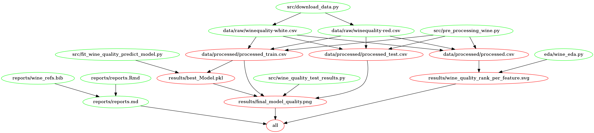

# Wine Quality Predictor

Authors: 
Member | Github
-------|---------
Bruhat Musunuru |[bruhatm](https://github.com/BruhatM)
Alex Truong Hai Yen | [athy9193](https://github.com/athy9193)
Rui Wang |[wang-rui](https://github.com/wang-rui)
Sang Yoon Lee |[rissangs](https://github.com/rissangs)

Second milestone of a data analysis project for DSCI 522: Data Science workflows, part of Master of Data Science program at the University of British Columbia.

## About

Here we attempt to build a model to predict the quality of a given wine sample using its features, composition and characteristics. Traditional methods of categorizing wine are prone to human error and  time-consuming. We propose a data mining approach to predict human wine taste preferences based on complex data analytical algorithms and classification models. This unbiased and human error free metric can provide a standardized metric that can be used for personalized wine recommendation, quality assessment and comparison unit. It can also be used by wineries as an important metric which could aid in important business decisions and strategies.
	
The data set used in this project is created by Paulo Cortez from the University of Minho in Guimarães, Portugal, and A. Cerdeira, F. Almeida, T. Matos and J. Reis from the Viticulture Commission of the Vinho Verde Region in Porto, Portugal. The two datasets are included are related to red and white vinho verde wine samples, from the north of Portugal. It was sourced from the UCI Machine Learning Repository and can be found [here](https://archive.ics.uci.edu/ml/machine-learning-databases/wine-quality/). Each row in the data set represents summary statistics from a sample of wine based on physicochemical tests with attributes fixed acidity, volatile acidity, citric acid, residual sugar, pH, etc.  

  We built a classification model using Multi-layer Perceptron classifier to predict the quality class of a given wine. To summarise, our model classifies wine into one of three classses, poor-normal-excellent. We have had good prediction accuracies and f1-score with this model and through our analysis we also found that it generalizes well. For complete report , please check the report section.


 
## Report

The final report can be found [here](https://github.com/UBC-MDS/Wine_Quality_Predictor/blob/main/reports/reports.md)

## Usage

To replicate the analysis, clone this GitHub repository, install the
[dependencies](#dependencies) listed below, and run the following
commands at the command line/terminal from the root directory of this
project: 

```bash
make all

````
To reset the repo to a clean state, with no intermediate or results files, run the following command at the command line/terminal from the root directory of this project:

```bash
make clean

```
## Dependencies

To run this project, please install 

* Python version 3.8.6 and the required dependencies from [here](https://github.com/UBC-MDS/Wine_Quality_Predictor/blob/main/wine_env.yml) by running the following command at the command line/terminal


```bash
# create a conda environment using the `wine_env.yml`
conda env create --file wine_env.yml
conda activate wine_env
```

* R version 4.0.2. and R packages:
     - knitr==1.30
     - kableExtra==1.3.1
     - tidyverse==1.3.0


## Dependency Diagram

The diagram below shows the structure of how the project and this repo is structured to produce the final results.




## License

The Wine Quality Predictor materials here are licensed under the
Creative Commons Attribution 2.5 Canada License (CC BY 2.5 CA). If
re-using/re-mixing please provide attribution and link to this webpage.

# References

<div id="refs" class="references">

<div>

Paulo Cortez, University of Minho, Guimarães, Portugal, http://www3.dsi.uminho.pt/pcortez
A. Cerdeira, F. Almeida, T. Matos and J. Reis, Viticulture Commission of the Vinho Verde Region(CVRVV), Porto, Portugal
@2009
</div>

<div>

P. Cortez, A. Cerdeira, F. Almeida, T. Matos and J. Reis.
Modeling wine preferences by data mining from physicochemical properties. In Decision Support Systems, Elsevier, 47(4):547-553, 2009. https://archive.ics.uci.edu/ml/datasets/Wine+Quality

</div>

<div>
  
Sample Milestone 1 on Breast Cancer for 552 by author: Tiffany Timbers, contributors: Melissa Lee. https://github.com/ttimbers/breast_cancer_predictor/tree/v1.1

</div>

</div>

