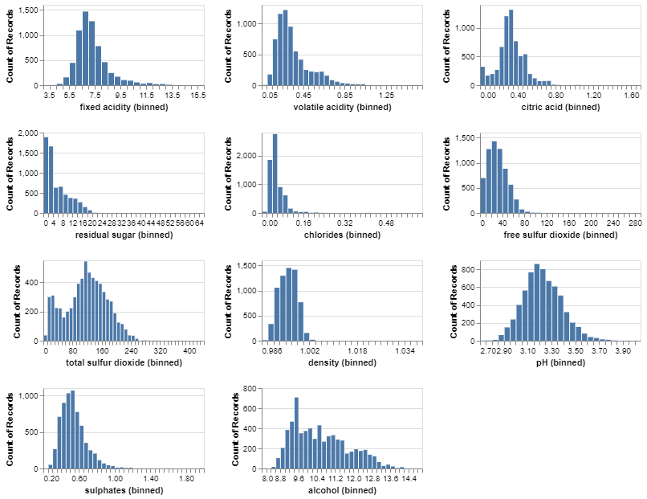
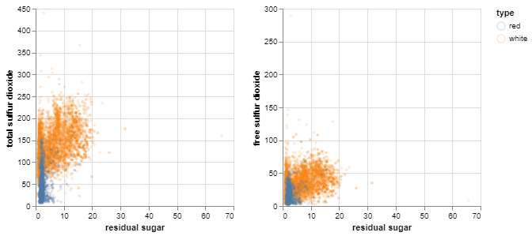

# EDA on Wine Quality Data Set

    The rpy2.ipython extension is already loaded. To reload it, use:
      %reload_ext rpy2.ipython
    

## Summary of the data set
The data set used in this project is the results of a chemical analysis of the Portuguese "Vinho Verde" wine, conducted by [Paulo Cortez, University of Minho, Guimarães,
Portugal](http://www3.dsi.uminho.pt/pcortez) A. Cerdeira, F. Almeida, T.
Matos and J. Reis, Viticulture Commission of the Vinho Verde Region(CVRVV), Porto, Portugal @2009. It was sourced from the [UCI Machine
Learning Repository](https://archive.ics.uci.edu/ml/datasets/wine+quality).

There are two datasets for red and white wine samples. For each wine sample observation , the inputs contains measurements of various objective physicochemical tests, and the output is the median wine quality ratings given by experts on the scale from 0 (very bad) and 10 (very excellent).The author notes that data on grape types, wine brand, wind selling price among other are not available due to privacy and logistics issues. There are 1599 observations for red wine and 4898 observations of white wine.

## Data import

## Preprocessing

<table border="1" class="dataframe">
  <thead>
    <tr style="text-align: right;">
      <th></th>
      <th>fixed acidity</th>
      <th>volatile acidity</th>
      <th>citric acid</th>
      <th>residual sugar</th>
      <th>chlorides</th>
      <th>free sulfur dioxide</th>
      <th>total sulfur dioxide</th>
      <th>density</th>
      <th>pH</th>
      <th>sulphates</th>
      <th>alcohol</th>
      <th>quality</th>
    </tr>
  </thead>
  <tbody>
    <tr>
      <th>count</th>
      <td>4898.000000</td>
      <td>4898.000000</td>
      <td>4898.000000</td>
      <td>4898.000000</td>
      <td>4898.000000</td>
      <td>4898.000000</td>
      <td>4898.000000</td>
      <td>4898.000000</td>
      <td>4898.000000</td>
      <td>4898.000000</td>
      <td>4898.000000</td>
      <td>4898.000000</td>
    </tr>
    <tr>
      <th>mean</th>
      <td>6.854788</td>
      <td>0.278241</td>
      <td>0.334192</td>
      <td>6.391415</td>
      <td>0.045772</td>
      <td>35.308085</td>
      <td>138.360657</td>
      <td>0.994027</td>
      <td>3.188267</td>
      <td>0.489847</td>
      <td>10.514267</td>
      <td>5.877909</td>
    </tr>
    <tr>
      <th>std</th>
      <td>0.843868</td>
      <td>0.100795</td>
      <td>0.121020</td>
      <td>5.072058</td>
      <td>0.021848</td>
      <td>17.007137</td>
      <td>42.498065</td>
      <td>0.002991</td>
      <td>0.151001</td>
      <td>0.114126</td>
      <td>1.230621</td>
      <td>0.885639</td>
    </tr>
    <tr>
      <th>min</th>
      <td>3.800000</td>
      <td>0.080000</td>
      <td>0.000000</td>
      <td>0.600000</td>
      <td>0.009000</td>
      <td>2.000000</td>
      <td>9.000000</td>
      <td>0.987110</td>
      <td>2.720000</td>
      <td>0.220000</td>
      <td>8.000000</td>
      <td>3.000000</td>
    </tr>
    <tr>
      <th>25%</th>
      <td>6.300000</td>
      <td>0.210000</td>
      <td>0.270000</td>
      <td>1.700000</td>
      <td>0.036000</td>
      <td>23.000000</td>
      <td>108.000000</td>
      <td>0.991723</td>
      <td>3.090000</td>
      <td>0.410000</td>
      <td>9.500000</td>
      <td>5.000000</td>
    </tr>
    <tr>
      <th>50%</th>
      <td>6.800000</td>
      <td>0.260000</td>
      <td>0.320000</td>
      <td>5.200000</td>
      <td>0.043000</td>
      <td>34.000000</td>
      <td>134.000000</td>
      <td>0.993740</td>
      <td>3.180000</td>
      <td>0.470000</td>
      <td>10.400000</td>
      <td>6.000000</td>
    </tr>
    <tr>
      <th>75%</th>
      <td>7.300000</td>
      <td>0.320000</td>
      <td>0.390000</td>
      <td>9.900000</td>
      <td>0.050000</td>
      <td>46.000000</td>
      <td>167.000000</td>
      <td>0.996100</td>
      <td>3.280000</td>
      <td>0.550000</td>
      <td>11.400000</td>
      <td>6.000000</td>
    </tr>
    <tr>
      <th>max</th>
      <td>14.200000</td>
      <td>1.100000</td>
      <td>1.660000</td>
      <td>65.800000</td>
      <td>0.346000</td>
      <td>289.000000</td>
      <td>440.000000</td>
      <td>1.038980</td>
      <td>3.820000</td>
      <td>1.080000</td>
      <td>14.200000</td>
      <td>9.000000</td>
    </tr>
  </tbody>
</table>

<table border="1" class="dataframe">
  <thead>
    <tr style="text-align: right;">
      <th></th>
      <th>fixed acidity</th>
      <th>volatile acidity</th>
      <th>citric acid</th>
      <th>residual sugar</th>
      <th>chlorides</th>
      <th>free sulfur dioxide</th>
      <th>total sulfur dioxide</th>
      <th>density</th>
      <th>pH</th>
      <th>sulphates</th>
      <th>alcohol</th>
      <th>quality</th>
    </tr>
  </thead>
  <tbody>
    <tr>
      <th>count</th>
      <td>1599.000000</td>
      <td>1599.000000</td>
      <td>1599.000000</td>
      <td>1599.000000</td>
      <td>1599.000000</td>
      <td>1599.000000</td>
      <td>1599.000000</td>
      <td>1599.000000</td>
      <td>1599.000000</td>
      <td>1599.000000</td>
      <td>1599.000000</td>
      <td>1599.000000</td>
    </tr>
    <tr>
      <th>mean</th>
      <td>8.319637</td>
      <td>0.527821</td>
      <td>0.270976</td>
      <td>2.538806</td>
      <td>0.087467</td>
      <td>15.874922</td>
      <td>46.467792</td>
      <td>0.996747</td>
      <td>3.311113</td>
      <td>0.658149</td>
      <td>10.422983</td>
      <td>5.636023</td>
    </tr>
    <tr>
      <th>std</th>
      <td>1.741096</td>
      <td>0.179060</td>
      <td>0.194801</td>
      <td>1.409928</td>
      <td>0.047065</td>
      <td>10.460157</td>
      <td>32.895324</td>
      <td>0.001887</td>
      <td>0.154386</td>
      <td>0.169507</td>
      <td>1.065668</td>
      <td>0.807569</td>
    </tr>
    <tr>
      <th>min</th>
      <td>4.600000</td>
      <td>0.120000</td>
      <td>0.000000</td>
      <td>0.900000</td>
      <td>0.012000</td>
      <td>1.000000</td>
      <td>6.000000</td>
      <td>0.990070</td>
      <td>2.740000</td>
      <td>0.330000</td>
      <td>8.400000</td>
      <td>3.000000</td>
    </tr>
    <tr>
      <th>25%</th>
      <td>7.100000</td>
      <td>0.390000</td>
      <td>0.090000</td>
      <td>1.900000</td>
      <td>0.070000</td>
      <td>7.000000</td>
      <td>22.000000</td>
      <td>0.995600</td>
      <td>3.210000</td>
      <td>0.550000</td>
      <td>9.500000</td>
      <td>5.000000</td>
    </tr>
    <tr>
      <th>50%</th>
      <td>7.900000</td>
      <td>0.520000</td>
      <td>0.260000</td>
      <td>2.200000</td>
      <td>0.079000</td>
      <td>14.000000</td>
      <td>38.000000</td>
      <td>0.996750</td>
      <td>3.310000</td>
      <td>0.620000</td>
      <td>10.200000</td>
      <td>6.000000</td>
    </tr>
    <tr>
      <th>75%</th>
      <td>9.200000</td>
      <td>0.640000</td>
      <td>0.420000</td>
      <td>2.600000</td>
      <td>0.090000</td>
      <td>21.000000</td>
      <td>62.000000</td>
      <td>0.997835</td>
      <td>3.400000</td>
      <td>0.730000</td>
      <td>11.100000</td>
      <td>6.000000</td>
    </tr>
    <tr>
      <th>max</th>
      <td>15.900000</td>
      <td>1.580000</td>
      <td>1.000000</td>
      <td>15.500000</td>
      <td>0.611000</td>
      <td>72.000000</td>
      <td>289.000000</td>
      <td>1.003690</td>
      <td>4.010000</td>
      <td>2.000000</td>
      <td>14.900000</td>
      <td>8.000000</td>
    </tr>
  </tbody>
</table>

Base on the brief summary of the data above, there is no missing value, all the features have numeric values, hence there is no major preprocessing needed besides combining the two data set of red wine and white wine to consider wine type (i.e. red or wine) as another possible features that could link to wine quality.

<table border="1" class="dataframe">
  <thead>
    <tr style="text-align: right;">
      <th></th>
      <th>fixed acidity</th>
      <th>volatile acidity</th>
      <th>citric acid</th>
      <th>residual sugar</th>
      <th>chlorides</th>
      <th>free sulfur dioxide</th>
      <th>total sulfur dioxide</th>
      <th>density</th>
      <th>pH</th>
      <th>sulphates</th>
      <th>alcohol</th>
      <th>quality</th>
      <th>type</th>
    </tr>
  </thead>
  <tbody>
    <tr>
      <th>0</th>
      <td>7.0</td>
      <td>0.270</td>
      <td>0.36</td>
      <td>20.7</td>
      <td>0.045</td>
      <td>45.0</td>
      <td>170.0</td>
      <td>1.00100</td>
      <td>3.00</td>
      <td>0.45</td>
      <td>8.8</td>
      <td>6</td>
      <td>white</td>
    </tr>
    <tr>
      <th>1</th>
      <td>6.3</td>
      <td>0.300</td>
      <td>0.34</td>
      <td>1.6</td>
      <td>0.049</td>
      <td>14.0</td>
      <td>132.0</td>
      <td>0.99400</td>
      <td>3.30</td>
      <td>0.49</td>
      <td>9.5</td>
      <td>6</td>
      <td>white</td>
    </tr>
    <tr>
      <th>2</th>
      <td>8.1</td>
      <td>0.280</td>
      <td>0.40</td>
      <td>6.9</td>
      <td>0.050</td>
      <td>30.0</td>
      <td>97.0</td>
      <td>0.99510</td>
      <td>3.26</td>
      <td>0.44</td>
      <td>10.1</td>
      <td>6</td>
      <td>white</td>
    </tr>
    <tr>
      <th>3</th>
      <td>7.2</td>
      <td>0.230</td>
      <td>0.32</td>
      <td>8.5</td>
      <td>0.058</td>
      <td>47.0</td>
      <td>186.0</td>
      <td>0.99560</td>
      <td>3.19</td>
      <td>0.40</td>
      <td>9.9</td>
      <td>6</td>
      <td>white</td>
    </tr>
    <tr>
      <th>4</th>
      <td>7.2</td>
      <td>0.230</td>
      <td>0.32</td>
      <td>8.5</td>
      <td>0.058</td>
      <td>47.0</td>
      <td>186.0</td>
      <td>0.99560</td>
      <td>3.19</td>
      <td>0.40</td>
      <td>9.9</td>
      <td>6</td>
      <td>white</td>
    </tr>
    <tr>
      <th>...</th>
      <td>...</td>
      <td>...</td>
      <td>...</td>
      <td>...</td>
      <td>...</td>
      <td>...</td>
      <td>...</td>
      <td>...</td>
      <td>...</td>
      <td>...</td>
      <td>...</td>
      <td>...</td>
      <td>...</td>
    </tr>
    <tr>
      <th>1594</th>
      <td>6.2</td>
      <td>0.600</td>
      <td>0.08</td>
      <td>2.0</td>
      <td>0.090</td>
      <td>32.0</td>
      <td>44.0</td>
      <td>0.99490</td>
      <td>3.45</td>
      <td>0.58</td>
      <td>10.5</td>
      <td>5</td>
      <td>red</td>
    </tr>
    <tr>
      <th>1595</th>
      <td>5.9</td>
      <td>0.550</td>
      <td>0.10</td>
      <td>2.2</td>
      <td>0.062</td>
      <td>39.0</td>
      <td>51.0</td>
      <td>0.99512</td>
      <td>3.52</td>
      <td>0.76</td>
      <td>11.2</td>
      <td>6</td>
      <td>red</td>
    </tr>
    <tr>
      <th>1596</th>
      <td>6.3</td>
      <td>0.510</td>
      <td>0.13</td>
      <td>2.3</td>
      <td>0.076</td>
      <td>29.0</td>
      <td>40.0</td>
      <td>0.99574</td>
      <td>3.42</td>
      <td>0.75</td>
      <td>11.0</td>
      <td>6</td>
      <td>red</td>
    </tr>
    <tr>
      <th>1597</th>
      <td>5.9</td>
      <td>0.645</td>
      <td>0.12</td>
      <td>2.0</td>
      <td>0.075</td>
      <td>32.0</td>
      <td>44.0</td>
      <td>0.99547</td>
      <td>3.57</td>
      <td>0.71</td>
      <td>10.2</td>
      <td>5</td>
      <td>red</td>
    </tr>
    <tr>
      <th>1598</th>
      <td>6.0</td>
      <td>0.310</td>
      <td>0.47</td>
      <td>3.6</td>
      <td>0.067</td>
      <td>18.0</td>
      <td>42.0</td>
      <td>0.99549</td>
      <td>3.39</td>
      <td>0.66</td>
      <td>11.0</td>
      <td>6</td>
      <td>red</td>
    </tr>
  </tbody>
</table>

6497 rows × 13 columns

## Univariate Analysis

#### Distribution of wine quality ratings

    

    

Wine quality ratings range between 3-9. Although the rating value is in numeric values, it seems to serve as discrete ranking categories rather then a continuous scoring scale. Most of the wine are rated as 5 and 6.

Additionally, the sample size is too smalle for some of the extreme values such as 3, 4 or 9. It is maybe useful to group the rating categories to increase each rating's sample size as follows.

    

    

#### Distribution of type of wine

    

    

There are roughly 3 times more white wine than red wine in this data set. So the data is not balanced, which is consistent with the data description.

#### Distribution of other numeric features

    

    

Most of the feature distributions above are right-skewed (exept for probability `pH`).

Distribution of `total_sulfur dioxide` feature are also bi-modal

Features like `residual_sugar`, `density`, or `chlorides` seem have extreme outliers given its distribution is highly right-skewed.

## Bivariate Analysis

#### Correlation matrix

    

    

We noticed that there is very high positive correlation between `free_sulfur_dioxide` and `total_sulfur_dioxide`, which make sense.

`density` is positively correlated with `chlorides`, `residual_sugar`, `volatile_acidity`, `fixed_acidity`, but is negatively correlated with `alcohol` level, which seems to suggest that high density wine has less acohol content.

`residual_sugar` also seems to have strong positive relation with `free_sulfur_dioxide`, `total_sulfur_dioxide` level and `density`

We can explore these relationship further in the scattered plot between these pairs of features as well as their relationships with the target `quality`

#### Pairwise relationship

**Density and other features**

    

    

The above chartes seems to confirmed findings from the corelation matrix where `density` is positively correlated with `chlorides`, `residual sugar`, `volatile acidity`, `fixed acidity` and negatively correlted to `alcohol`. These correlations seems to be comparables between red wine and white wine as the data clouds of the respective wine type seem to overlap in most plots, saving for `residual sugar`. This is also understand about give white wine seems to be more tangy than red wine.

We also notice that `residual sugar` seems to have noticable positive association with `sulfur dioxide` level. Let's further explore this relation ship with the plot below by wine type.

**Residual suger and sulfur dioxide level**

    

    

An interesting trend here is that the positive relationship between `residual sugar` and `sulfur dioxide` level seems more pronounced for white wine rather than red wine. For red wine, across different sulfur dioxide levels, the residual sugar levels remain within the range from 0-10.

#### Relationship between features and wine quality

    

    

Based on wine quality composition plot above, there seems to be more excellent white wines

For the numeric features, we look at their distribution in the respective wine quality group in the chart below.

    

    

We can see that the `alcohol` level for excellent wine seems to be noticeably higher than that of normal or poor wine. Excellent wine also lower `density` than lower-quality wine. This agrees with our earlier correlation analysis between the features.

Better ranked wine also seem to have higher `free sulfur dioxide` level than poor wine though the relationship is not that clear based on the boxplot.

High `volatile acidility` also seems to be indicative of better wine.

`citrid acid` level for excelent wine only restrict within the 0.0-0.8 range.

## Summary of Insights from EDA

After the EDA, we see that wine quality ranking seems to be more likely to associate with `alcohol`, `density`,  `free sulfur dioxide`, `volatile acidity`, `citric acid`. Hence a multiclass linear classification could be appropriate to estimate the impact each features have on wine quality ranking.

We also note that `density` and `alcohol` are highly negatively correlated. We might pick either element to put in our model. On the other hand, the smaller correlation among the above-mentioned variables and the fact that the output `quality_rank` are imbalanced are issues that we should take note and find ways to elevate of when conducting our research method and modeling subsequently.
