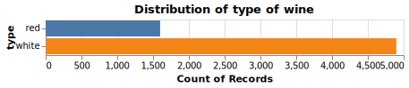
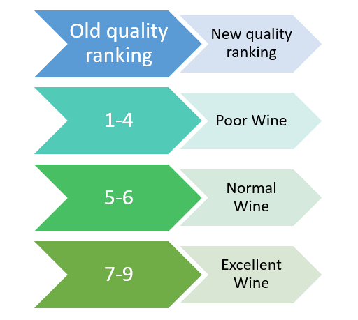
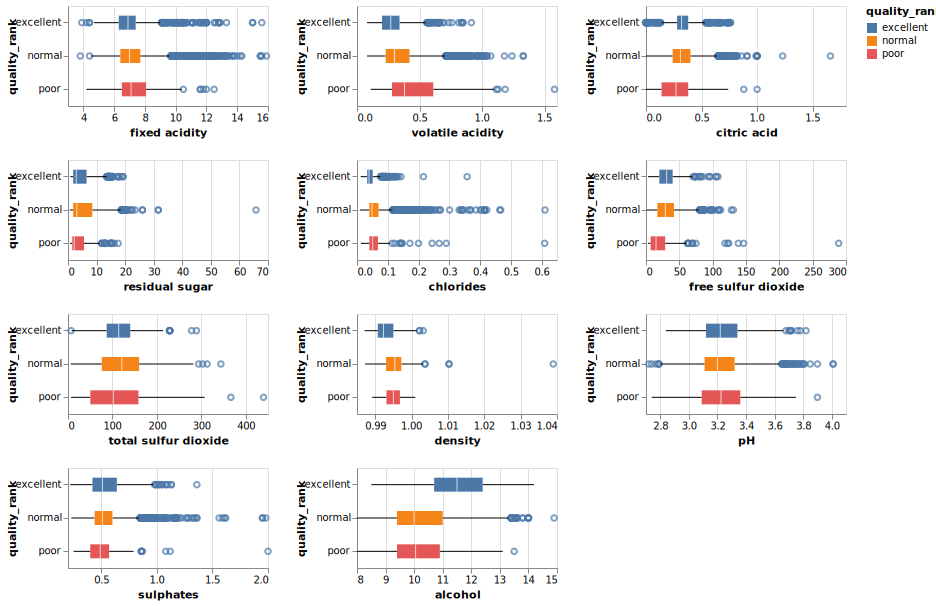
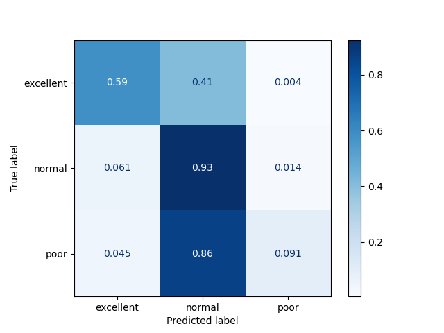

```{r setup, include=FALSE}
knitr::opts_chunk$set(echo = FALSE)
library(knitr)
library(kableExtra)
library(tidyverse)
```

## Summary

For this analysis, we used the neutral network Multi-layer Perception (MLP) model in order to try to predict wine quality based on the different wine attributes obtained from physicochemical tests such as alcohol, sulfur dioxide, fixed acidity, residual sugar. When we test it with the different validation data sets, the model yield robust results with 80% accuracy and 80% f1- score (a weighted average metric between precision and recall rate). We also have comparably high score at 80% accuracy and f1-score when we run the model on our test set. Based on these results, we opine that that the model seems to generalize well based on the test set predictions. 


However, it incorrectly classifies 13.7% of the data in the lower end of spectrum (between normal and poor). This could be due to class imbalance present in the data set where normal samples outnumber poor by roughly twenty times. Improving the data collection methods to reduce the data class imbalance and using an appropriate assessment metric for imbalanced data can help to improve our analysis. On the other hand, given the rate of miss-classification is not so high and the impact can be corrected in further assessment, we believe this model could decently serve its purpose as a wine predictor to conduct first-cut assessment, which could help speed up the wine ratings process.

## Introduction

Traditional methods of categorizing wine are prone to human error and can vary drastically from expert to expert. We propose a data mining approach to predict wine quality using machine learning techniques for classification problems. The resulting model, we hope, could serve as as one of scientific and systematic ways to classify wine, which is a springboard for further research in personalized wine recommendation, quality assessment and comparison unit.

Moreover, we believe wineries or wine rating institutes could find the model as a useful and reliable first-cut wine quality test before further expert's assessment. This could lead to a more cost and time-effective wine screening process, and subsequently facilitate more effective and efficient business decisions and strategies.

## Methods

### Data

The data set used in this project is the results of a chemical analysis of the Portuguese "Vinho Verde" wine, conducted by Paulo Cortez, A. Cerdeira, F. Almeida, T. Matos and J. Reis [@cortez2009modeling]. It was sourced from the UCI Machine Learning Repository [@Dua:2019] which can be found [here](https://archive.ics.uci.edu/ml/datasets/wine+quality).

There are two datasets for red and white wine samples. For each wine sample observation , the inputs contains measurements of various objective physicochemical tests, and the output is the median wine quality ratings given by experts on the scale from 0 (very bad) and 10 (very excellent).The author notes that data on grape types, wine brand, wind selling price among other are not available due to privacy and logistics issues. There are 1599 observations for red wine and 4898 observations of white wine.

```{r, fig.cap = "Figure 1: Distribution of type of wine", out.width= "50%", fig.align='center'}


```

### Analysis

At the preprocessing stage, we decided to combine the red and white data set as well as group the data in bigger classification, namely "poor", "normal" and "excellent" for scale "1-4", "5-6" and "7-9" so as to have bigger sample size (as per Figure 2). We acknowledge that the data is imbalanced, hence instead of only using accuracy based to judge the model performance, we also include f1-score and use it as our main assessment metric. f-1 score is metric that combine both the precision and recall metrics, which focus on the false negative and false positive rate of the data and would be appropriate to use with an imbalanced data set.{Bruhat: to add more justification for f-1 micro score}

```{r, fig.cap = "Figure 2: Regrouping of wine quality classification", out.width= "50%", fig.align='center'}


```

In this project we are trying to predict the quality of a given wine sample using wine attributes obtained from various physicochemical tests. Based on our literary review, we found that researchers from Karadeniz Technical Univeristy used Random Forest Algorithm had also tried to classify between red wine and white wine for the same dataset [@er2016classification]. They further used 3 different data mining algorithms namely k-nearest-neighbourhood random forests and support vector machine learning to classify the quality of both red wine and white wine. This motivates us to proceed with to use cross-validation to select the best model for our analysis.

We eventually decided to pick neutral network Multi-layer Perception (MLP) model as the model that yield the best results after running the various machine learning models through the train data set, comparing their performance based on f1-score and checking consistency across cross-validation runs. We noticed that random forest recorded high f1-validation score at 0.84, however, it also had a large gap between train and validation with a perfect train score of 1. This caused us to think the model has overfitted. Logistic regression also showed promising f1 validation score results in our case, yet this high results were not consistent across cross-validation splits. Hence, with most models struggled to get to the 0.8 f1-score mark without significantly overfitting on the train set, while MLP shows consistent results across all cross-validation splits, our final choice landed on MLP model because we think it would generalize better.

```{r, fig.cap = "Table 1: Score results among different machine learning model we have explore", fig.align='center'}
knitr::include_graphics("../results/f1_score_all_classifiers.svg")
```

The Python and R programming languages [@R; @Python] and the following Python and R packages were used to perform the analysis: scikit-learn [@scikit-learn], docoptpython [@docoptpython], docopt [@docopt], altair [@altair], vega-lite [@vega-lite], IPython-ipykernel [@IPython], matplotlib [@matplotlib], scipy [@SciPy], numpy [@harris2020array], pandas [@pandas], graphviz [@graphviz], pandas-profiling [@pandasprofiling2019], knitr [@knitr], tidyverse [@tidyverse], kableExtra [@kableExtra]. The code used to perform the analysis and re-create this report can be found [here](https://github.com/UBC-MDS/Wine_Quality_Predictor#usage)


## Results & Discussion


Looking at the distribution plot of the respective wine quality group interacting with each explanatory features, we can see that higher quality wine seems to be more associated with higher `alcohol` level and lower `density`. Lower `volatile acidity` also seems to be indicative of better wine. Better ranked wine also seem to have `higher free sulfur dioxide` level than poor wine though the relationship is not that clear based on the plot. The rest of the features do not seems be very distinguishable among different quality wine.

```{r distribution plot, fig.cap = "Figure 3: Distribution plot between wine quality and various attributes from physicochemical test", fig.align='center'}



```

Since this is a multi-class classification, our goal was to find a model that was consistent and able to recognize patterns from our data. We choose to use a neutral network Multi-layer Perception (MLP) model as it was consistent and showed promising results. If we take a look at the accuracy scores and f1 scores across cross validation splits, we can see that it is pretty consistent which was not the case with many models.

```{r, echo=FALSE,out.width="50%", out.height="20%",fig.cap="Figure 4: Accuracy scores and f1 scores across cross validation splits for neutral network Multi-layer Perception (MLP) model",fig.show='hold',fig.align='center'}
knitr::include_graphics(c("../results/f1_score_random_forest.svg","../results/f1_score_mlp.svg"))
``` 


Our model performed quite well on the test data as well. If we take a look at the confusion matrix below. As we discussed earlier, the prediction at the lower end of wine quality spectrum is acceptable. As we can see from the confusion matrix below, ~13% error rate for the lower end of spectrum and also very acceptable false classifications in the high end of spectrum.

```{r, fig.cap = "Figure 5: Confusion Matrix", fig.align='center'}

```

Having said that the research also need further improvement in terms of obtaining a more balanced data set for training and cross-validation. More feature engineer and selection could be conducted to minimize the affect of correlation among the explanatory variable. Furthermore, in order to assess the robustness of the predicting model, we need to test the model with deployment data in real world besides testing with our test data.

In conclusion, we think that with a decent error rate, our predicting model based on neutral network Multi-layer Perception (MLP) model would serve well as an effective first-cut assessment on wine quality. 

# References
