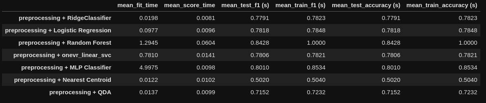
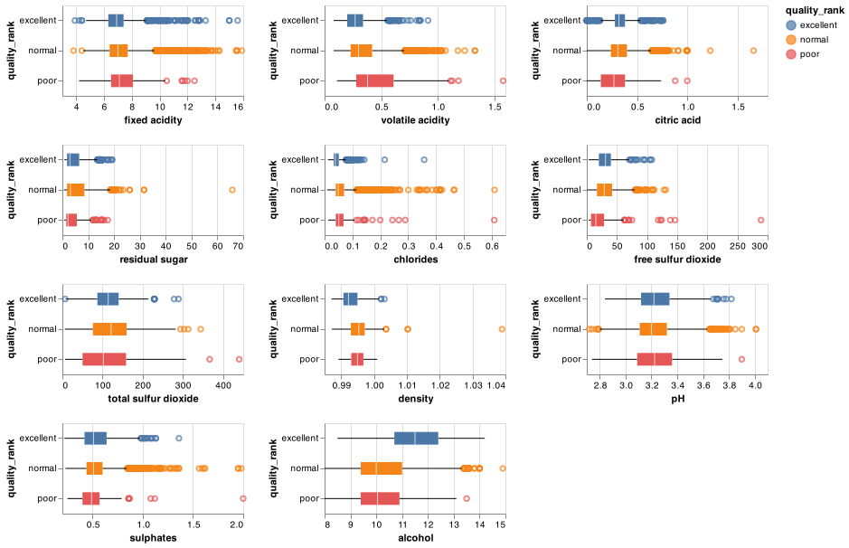
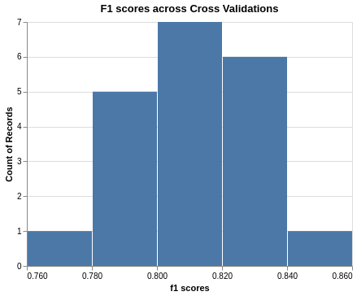
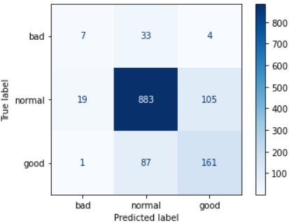

Predicting wine quality using measurements of physiochemical tests
================
Alex Truong, Bruhat Musinuru, Rui Wang and Sang Yoon Lee  
2020-11-26 (updated: 2020-11-28)

  - [Summary](#summary)
  - [Introduction](#introduction)
  - [Methods](#methods)
      - [Data](#data)
      - [Analysis](#analysis)
  - [Results & Discussion](#results-discussion)
  - [References](#references)

## Summary

For this analysis, we used the neutral network Multi-layer Perception
(MLP) model in order to try to predict the different wine quality based
on the wine attributes obtained from various physicochemical tests such
as alcohol, sulfur dioxide, fixed acidity, residual sugar. The results
showed that MLP yield robust results with 80% accuracy and 80% f1- score
(i.e. a weighted average metric of the precision and recall) on
validation set. When we run the model on our test set, we also have
comparably high score at 80% accuracy and f1-score. Based on these
scores, we can confidently say that that the model seem to generalize
well based on the test set predictions. However, it incorrectly
classifies 15% of the data in the higher end of spectrum(between normal
and excellent). This could be due to class imbalance present in the
dataset (normal samples outnumber excellent by three times) where more
observations are of class normal. Improving the data collection methods
to include more samples of excellent wine can help give more data to the
model and improve it while helping it generalize it better.

But, As the rate of miss-classification is not high and the impact can
be corrected in further assessment, we believe this model could decent
serve its purpose as a wine predictor to conduct first-cut wine
classification, which could help speed up the wink ratings process.

## Introduction

Traditional methods of categorizing wine are prone to human error and
can vary drastically from expert to expert. We propose a data mining
approach to predict wine quality using machine learning techniques for
classification problems. The resulting model, we hope, could serve as as
one of scientific and systematic ways to classify wine, which is a
springboard for further research in personalized wine recommendation,
quality assessment and comparison unit.

Moreover, we believe wineries or wine rating institutes could find the
model as a useful and reliable first-cut wine quality test before
further expert’s assessment. This could lead to a more cost and
time-effective wine screening process, and subsequently facilitate more
effective and efficient business decisions and strategies.

## Methods

### Data

The data set used in this project is the results of a chemical analysis
of the Portuguese “Vinho Verde” wine, conducted by Paulo Cortez, A.
Cerdeira, F. Almeida, T. Matos and J. Reis \[@cortez2009modeling\]. It
was sourced from the UCI Machine Learning Repository \[@Dua:2019\] which
can be found
[here](https://archive.ics.uci.edu/ml/datasets/wine+quality).

There are two datasets for red and white wine samples. For each wine
sample observation , the inputs contains measurements of various
objective physicochemical tests, and the output is the median wine
quality ratings given by experts on the scale from 0 (very bad) and 10
(very excellent).The author notes that data on grape types, wine brand,
wind selling price among other are not available due to privacy and
logistics issues. There are 1599 observations for red wine and 4898
observations of white wine.

### Analysis

At the preprocessing stage, we decided to combine the red and white data
set as well as group the data in bigger classification, namely “poor”,
“normal” and “excellent” for scale “1-4”, “5-6” and “7-9” so as to
have bigger sample size. We acknowledge that the data is imbalanced,
hence instead of only using accuracy based to judge the model
performance, we also include f1-score and use it as our main assessment
metric. f-1 score is metric that combine both the precision and recall
metrics, which focus on the false negative and false positive rate of
the data and would be appropriate to use with an imbalanced data set.

In this project we are trying to predict the quality of a given wine
sample using wine attributes obtained from various physicochemical
tests. Based on our literary review, we found that researchers from
Karadeniz Technical Univeristy used Random Forest Algorithm had also
tried to classify between red wine and white wine for the same dataset
\[@er2016classification\]. They further used 3 different data mining
algorithms namely k-nearest-neighbourhood random forests and support
vector machine learning to classify the quality of both red wine and
white wine. This motivate us to proceed with to use cross-validation to
select the best model for our analysis.

We eventually decided to pick neutral network Multi-layer Perception
(MLP) model as the model that yield the best results after running the
various machine learning models through the train dataset, comparing
their performance based on f1-score and checking consistency across
cross-validation runs. Most models struggled to get to the 0.8 f1 score
mark without overfitting on the train set. We considered various models
and metrics to pick MLP as it had consistent results across all
cross-validation splits we hoped it would generalize better. Logistic
regression and random forests also showed promising results in our case.
Although these algorithms had good f1 scores, random forest seems to
overfit on the train set and Logistic regression wasn’t consistent
across our cross-validation splits.

The Python and R programming languages \[@R; @Python\] and the following
Python and R packages were used to perform the analysis: scikit-learn
\[@scikit-learn\], docoptpython \[@docoptpython\], docopt \[@docopt\],
altair \[@altair\], vega-lite \[@vega-lite\], IPython-ipykernel
\[@IPython\], matplotlib \[@matplotlib\], scipy \[@SciPy\], numpy
\[@harris2020array\], pandas \[@pandas\], graphviz \[@graphviz\],
pandas-profiling \[@pandasprofiling2019\], knitr \[@knitr\], tidyverse
\[@tidyverse\], kableExtra \[@kableExtra\]. The code used to perform the
analysis and re-create this report can be found
[here](https://github.com/UBC-MDS/Wine_Quality_Predictor#usage)

## Results & Discussion

Looking at the distribution plot of the respective wine quality group
interacting with each explanatory features, we can see that higher
quality wine seems to be more associated with higher `alcohol` level and
lower `density`. Lower `volatile acidity` also seems to be indicative of
better wine. Better ranked wine also seem to have `higher free sulfur
dioxide` level than poor wine though the relationship is not that clear
based on the plot. The rest of the features do not seems be very
distinguishable among different quality wine.

Since this is a multi-class classification, our goal was to find a model
that was consistent and able to recognize patterns from our data. We
choose to use a neutral network, Multi-layer Perception (MLP) model as
it was consistent and showed promising results. If we take a look at the
accuracy scores and F1 scores across cross validation splits, we can see
that it is pretty consistent which was not the case with many models.

Our Model performed quite well on the test data as well. If we take a
look at the confusion matrix below. As we discussed earlier, the
prediction at the higher end of wine quality spectrum is acceptable but
more robust data collection methods or more variety of high quality wine
samples need to be sorted. As we can see from the confusion matrix
below, \~15% error rate for the higher end of spectrum and also very
acceptable false classifications in the low end of spectrum.

Having said that the research also need further improvement in terms of
obtaining a more balanced data set for training and cross-validation.
More feature engineer and selection could be conducted to minimize the
affect of correlation among the explanatory variable. Furthermore, in
order to assess the robustness of the predicting model, we need to test
the model with deployment data in real world besides testing with our
test data.

# References
